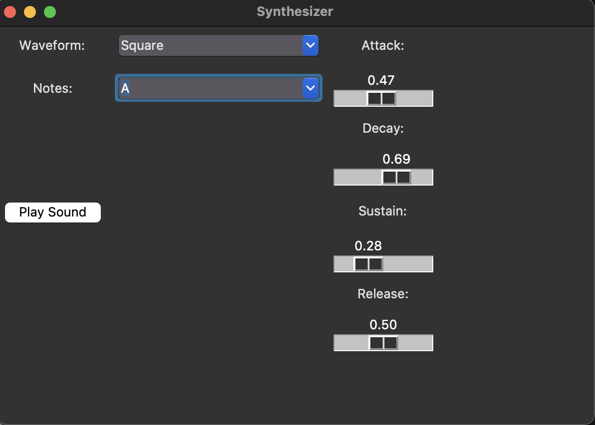

Audio Synthesizer

**Setup: Installation**
``pip install sounddevice``
``pip install tkinter``
``pip install numpy``

**Setup: Usage**
- Use the dropdown menus for waveform and sliders for ADSR to have desired settings for sound
- Then, for the notes dropdown menu, choose any note you want in the octave (from middle C to C5)
- Finally, click play to hear the transformed sound
- Below is a labeled picture of the UI

**Potential Application**

The synthesizer that we have made can be modified to make many real world digital noises that represent caution or danger, such as ambulance sirens, fire alarms, tornado warnings, etc. It can also be used simply to make music, like DJ beat drops, or record scratching. 

